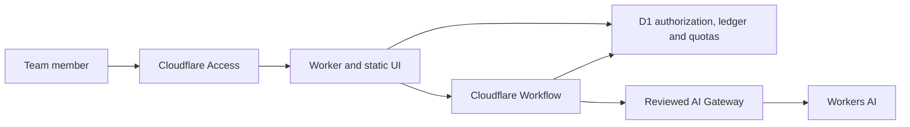

# TeamBoundary AI

[](https://github.com/Digidai/teamboundary-ai/actions/workflows/ci.yml)
[](https://github.com/Digidai/teamboundary-ai/actions/workflows/security.yml)
[](LICENSE)

**A secure multi-tenant AI workspace for teams, built entirely on Cloudflare.**

TeamBoundary AI is an independent open-source reference implementation for tenant-isolated AI chat
workflows. It combines Cloudflare Access, Workers, D1, Workflows, AI Gateway and Workers AI while
keeping identity, authorization, idempotency and cost limits explicit and fail-closed.

Version 0.1.0 is a source preview, not a hosted service, compliance certification, SLA, or claim of
zero risk. TeamBoundary AI is not affiliated with or endorsed by Cloudflare, Inc.

## What is included

- Cloudflare Access JWT verification with exact issuer, audience and RS256 validation.
- Pre-provisioned identities, organizations, roles and immediate membership revocation in D1.
- Tenant-scoped projects and bounded chat runs with no tools or autonomous actions.
- Atomic D1 creation of resources, idempotency receipts and audit records.
- D1-enforced deployment, organization and actor admission/cost ceilings.
- Cloudflare Workflows with deterministic instance IDs, reconciliation and bounded retention.
- One fixed Workers AI model behind a separately approved, pre-created AI Gateway.
- A static React interface served by the Worker.

The 0.1 boundary deliberately excludes arbitrary code execution, containers, browser automation,
file ingestion, object storage, embeddings, semantic search, public sign-up, external connectors and
request-time production provisioning.

## Architecture



D1 is the authorization and product-state authority. Every tenant query is scoped by organization.
Every paid inference attempt re-checks current membership and atomically claims organization and
deployment budgets immediately before the provider call. Workflow step state contains only
non-sensitive markers; prompt and response data stays in the tenant-scoped run record.

See [Architecture](docs/ARCHITECTURE.md) and [Threat model](docs/THREAT_MODEL.md) for the detailed
trust boundaries.

## Run locally

Requirements: Node.js 22 or newer and npm.

```bash
git clone https://github.com/Digidai/teamboundary-ai.git
cd teamboundary-ai
npm ci
cp .dev.vars.example .dev.vars
npm run check
npm run dev
```

Local development accepts a fixed loopback identity only when all three conditions are true:
`APP_ENV=development`, `AUTH_MODE=dev`, and the request hostname is loopback. AI is disabled by
default. Never copy local variables into a deployed environment.

`npm run check` validates runtime boundaries, dependency licenses, bundled notices, the fresh D1
migration, TypeScript, adversarial Node tests, real workerd integration tests, build output and
isolated deployment fixtures.

## Deployment safety

The checked-in configuration is intentionally non-deployable. It has placeholder resource IDs,
keeps Workers AI off, disables `workers.dev` and preview URLs, and has no public route.

Do not run the deployment command against an unreviewed account. Follow the fail-closed
[deployment runbook](docs/DEPLOYMENT.md), use a new empty D1 database, protect the exact hostname
with Cloudflare Access before business traffic, pre-provision members out of band, and leave the D1
AI kill switch off until Gateway guardrails, budgets and canaries have passed.

The source can be evaluated and forked under Apache-2.0. Operating a commercial service requires
separate privacy, retention/deletion, content-safety, incident-response, support, contractual,
trademark and Cloudflare account reviews. The stricter [hosted release checklist](docs/RELEASE_CHECKLIST.md)
tracks those requirements.

## Security and community

- Report vulnerabilities privately through [GitHub Private Vulnerability Reporting](https://github.com/Digidai/teamboundary-ai/security/advisories/new).
- Use [GitHub Issues](https://github.com/Digidai/teamboundary-ai/issues) for reproducible,
  non-sensitive defects and feature proposals.
- Read [CONTRIBUTING.md](CONTRIBUTING.md), [CODE_OF_CONDUCT.md](CODE_OF_CONDUCT.md) and
  [GOVERNANCE.md](GOVERNANCE.md) before contributing.
- Contributions require the contributor's own DCO 1.1 sign-off.

Never put credentials, tenant data, prompts, model output or vulnerability details in a public
issue or pull request.

## Independence, licensing and name

The implementation was developed from product requirements and public platform documentation under
the clean-room rules in [docs/CLEAN_ROOM.md](docs/CLEAN_ROOM.md). Automated comparisons and license
checks are supporting evidence, not a legal guarantee of non-infringement.

The code is licensed under [Apache-2.0](LICENSE). Dependencies and redistributed notices retain
their respective terms in [THIRD_PARTY_NOTICES.md](THIRD_PARTY_NOTICES.md) and
[THIRD_PARTY_LICENSES.txt](THIRD_PARTY_LICENSES.txt). Apache-2.0 does not license cloud services,
model weights, model output, third-party data or project and vendor trademarks.

`TeamBoundary AI` is an unregistered project identifier. A dated preliminary screen is documented
in [NAME_CLEARANCE.md](NAME_CLEARANCE.md); it is not formal trademark clearance. Forks and hosted
operators must follow [TRADEMARKS.md](TRADEMARKS.md) and avoid implying endorsement.
