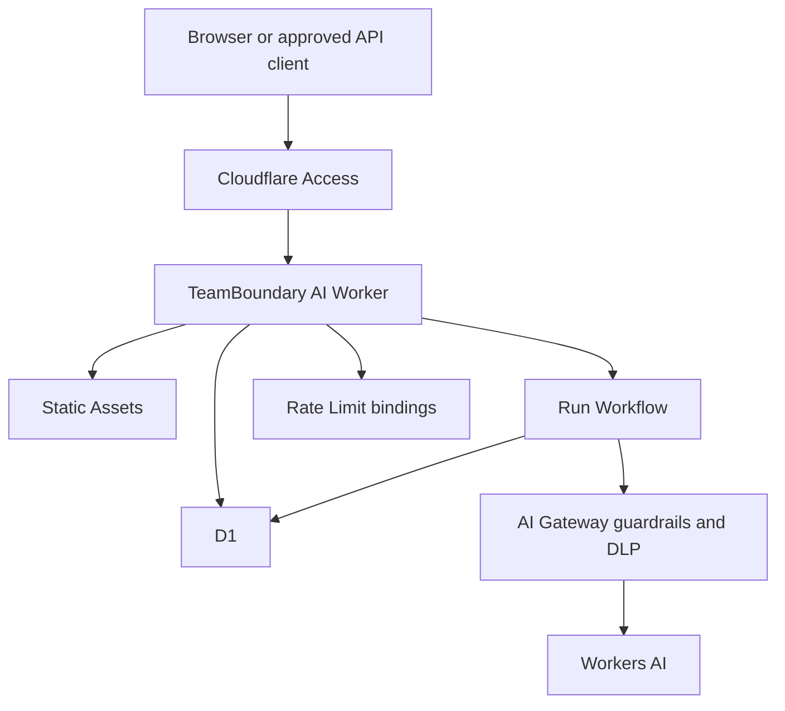

# Architecture

## Objective

TeamBoundary AI 0.1 minimizes the security and operational surface of a multi-tenant AI workflow. The
entire deployed product uses Cloudflare Access, one Worker with Static Assets, one fresh D1
database, one Workflow binding, one reviewed AI Gateway, Workers AI and four rate-limit bindings.
D1 remains the authority for identity, membership, tenant data, audit evidence, idempotency, quotas
and run state.



## Trust boundaries

### Authentication

The hostname is protected by Access, and the Worker still verifies the assertion signature,
algorithm, issuer, audience, expiry, issued-at, subject and email. The stable authorization identity
is `(issuer, subject)`; email is profile data. Production never creates an identity or membership on
a request path. An authenticated but unprovisioned subject receives `403`.

Development identity creation is possible only with exact development mode, the dev auth mode,
personal provisioning and a loopback hostname.

### Authorization and revocation

Every organization route loads active memberships from D1 and checks a role before reading a
receipt or executing a handler. Tenant child tables use organization-scoped foreign keys. A
membership is revoked by setting `revoked_at`; the row remains for historical referential integrity,
while the same still-valid Access JWT loses application access on its next request.

### Browser request integrity

All non-health API requests fail early when Fetch Metadata reports a cross-site context. Mutations
also require an exact same-origin `Origin` when present and a non-simple request marker. These are
CSRF defenses, not substitutes for authentication.

## Mutation and idempotency model

Project and run creation require an RFC UUID `Idempotency-Key`. The server hashes the bounded raw
JSON request bytes together with the normalized method/path, then validates the parsed body and
computes deterministic resource IDs from the actor, organization, route and key. Semantically
equivalent JSON with different bytes is therefore a different request for conflict detection.

After authorization and validation, a D1 batch atomically writes:

1. the project or pending run;
2. an audit event; and
3. a completed idempotency receipt containing the stable response.

The receipt key includes organization, identity, route and client key. Same key and same request
replays the stored response; same key and different request returns a conflict. Only the request
that commits a new run asks the Workflow binding to launch. A D1 marker and cron reconciliation
cover an ambiguous or interrupted launch.

## Durable run state

Run transitions are conditional:

```text
pending -> running -> completed
                   -> failed
pending ----------> failed
pending/running ---> cancelled (reserved state)
```

Terminal states never return to an active state. The deterministic Workflow ID is the run ID.
Pending instances have a one-hour wall-clock cap; running, paused or waiting instances have a
two-hour cap. Reconciliation best-effort terminates an over-age instance and conditionally marks
the D1 run failed. It never restarts inference for a terminal D1 run.

Workflow success and error state retention is explicitly one hour. The AI/D1 step catches sensitive
provider or database errors and exposes fixed error classes. The step returns only a non-sensitive
marker; model text is written directly to the tenant run row. An AI-enabled Worker version must
carry an approved Gateway ID. Missing configuration fails before run admission and again before the
provider call, so deployment drift cannot silently bypass the Gateway.

## Cost and resource bounds

Edge rate limiting protects ordinary request volume but is not treated as billing accounting because
Cloudflare rate-limit counters are local and eventually consistent. D1 provides the hard admission
ledger:

- deployment identity, active-run, daily-run and daily-AI-attempt ceilings;
- organization project, active-run, daily-run and AI-attempt ceilings; and
- per-actor daily run ceilings.

Run admission claims its counters in the same transaction as the run. Each real inference attempt
claims account and organization AI budget immediately before `AI.run`. A D1 singleton gate is
checked both when a new run commits and when an attempt is claimed, so changing it closes admission
for queued version-pinned Workflows as well as HTTP requests. The approved model, maximum input and
maximum output are fixed in code. The checked-in Worker version gate and D1 gate both default off.

## Data model and retention

The fresh migration creates these tables:

- `deployment_limits`, `identities`, `organizations`, `memberships`;
- `projects`, `runs`, `audit_events`, `idempotency_receipts`;
- account and organization daily usage ledgers.

Completed/failed runs use an organization-specific retention period, defaulting to 90 days. A
bounded cron delete uses a status/completion index; a database trigger removes the corresponding run
receipt and audit row. Usage counters older than eight days are pruned. Projects, identity profile
data and non-run audit/receipt data do not yet have a complete self-service lifecycle; a commercial
deployment must add coordinated export, deletion, offboarding and verification.

## API minimization

Run lists return a cursor-paginated summary without prompts or model output. Full content is returned
only by the authorized run detail endpoint using an explicit response shape; internal identity and
Workflow identifiers are not serialized. The client polls only when an active run exists, pauses
while hidden and backs off on failures.

## Deployment isolation

The public configuration contains invalid resource placeholders, disables `workers.dev` and preview
URLs, and sets Access auth, closed provisioning and disabled AI. A private absolute target manifest
injects an approved account, fresh D1 ID and four unique rate-limit namespace IDs. Staging and
production resource names are distinct. Deployment uses Wrangler strict mode with framework
autoconfiguration disabled.

New deployments must use a fresh empty D1 database. Editing the initial migration is not an upgrade
path for an older database. Any future schema change requires a forward-only numbered migration and
old-schema upgrade tests.

## Explicit exclusions

Version 0.1 has no arbitrary execution, uploads, object storage, search index, event queue, public
real-time channel, service binding or Durable Object. Adding any of those requires a new ADR,
threat-model change, cost budget, abuse tests, privacy lifecycle and separately approved rollout.
